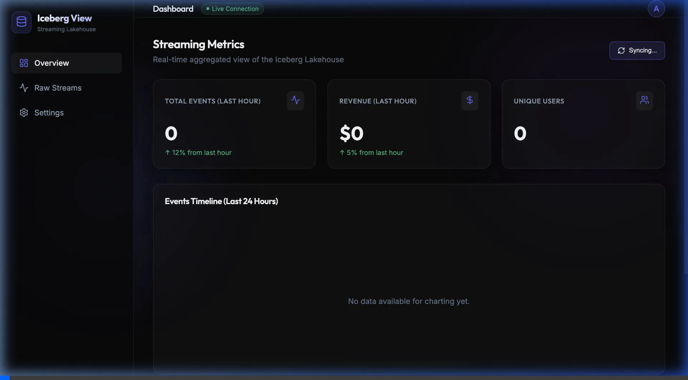

# Iceberg Streaming Lakehouse

This project demonstrates a real-time streaming data pipeline and lakehouse architecture using Apache Iceberg. It ingests simulated event data, processes it, stores it in a data lake, and visualizes it through a modern, real-time frontend dashboard.

## 🏗 Architecture

The platform consists of several key components:

1. **Ingestion (Kafka)**: A Python producer simulates real-time activity (e.g., page views, e-commerce events) and publishes them to an Apache Kafka topic.
2. **Processing (Flink)**: Apache Flink consumes streams from Kafka, processes them, and Sink writes the continuous stream into an Apache Iceberg table (`events_iceberg`), providing ACID transactions and schema evolution on streaming data.
3. **Storage (MinIO & Postgres)**: 
   - **MinIO** acts as the local S3-compatible object storage layer, holding the Parquet data and Iceberg metadata files.
   - **Postgres** powers the Iceberg REST Catalog, managing table metadata to ensure read consistency across engines.
4. **Query Engine (Trino)**: Trino connects to the Iceberg REST Catalog, providing a fast, distributed SQL engine to query the lakehouse interactively.
5. **Transformations (dbt)**: Data Build Tool (dbt) runs on top of Trino to aggregate raw events into materialized models (e.g., `hourly_page_views`).
6. **Frontend Dashboard (React/Vite)**: A real-time web application that proxies requests to Trino to display live KPI metrics, a timeline chart of events, and a feed of the raw streaming data.

## 🚀 Getting Started

### Demo Dashboard


*Real-time streaming dashboard built with React and Trino*

### Prerequisites
- Docker & Docker Compose
- Python 3.x
- Node.js & npm (for the frontend)

### Running the Infrastructure
Start the core services (Kafka, Flink, MinIO, Postgres, Iceberg REST, Trino) using Docker Compose:
```bash
cd streaming-lakehouse
docker-compose up -d
```

### Starting the Frontend Dashboard
Navigate to the frontend directory, install dependencies, and start the Vite dev server:
```bash
cd streaming-lakehouse/frontend
npm install
npm run dev
```
The dashboard will be available at `http://localhost:5173`. It features multiple views:
- **Overview**: High-level KPIs and a 24-hour event timeline.
- **Raw Streams**: A live tabular feed showing the absolute latest events ingested into Iceberg.

### Interacting with Data
1. Run your Python producer to start streaming events to Kafka.
2. Submit your Flink SQL job to start writing data into the Iceberg tables.
3. Run `dbt run` from the `dbt_project` directory to compute aggregations.
4. Watch the Dashboard update in real-time as background data refreshes!


*Navigate seamlessly between the Overview, Raw Streams, and Settings pages.*
