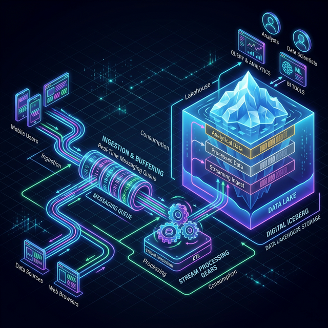
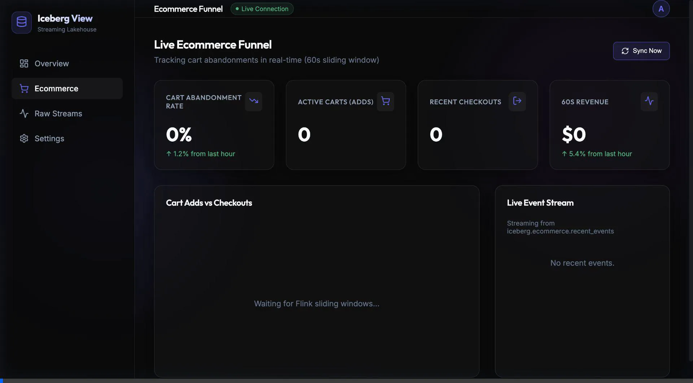

# Build a Streaming Lakehouse on a Laptop with Flink, Iceberg, Trino, and React

I’m seeing a massive shift in how companies approach real-time data. The traditional boundaries between "streaming" (for low-latency operations) and "batch" (for historical analytics) are dissolving into unified **Streaming Data Lakehouses**. These architectures deliver real-time analytical capabilities directly on top of open table formats without the need for bespoke, expensive operational NoSQL databases.

I’ve wanted to build a hands-on, end-to-end streaming lakehouse on my laptop for a while. Recently, I sat down and built this comprehensive local data system using Apache Kafka, Flink, Iceberg, Trino, dbt, and a React frontend.

But I didn't just build it manually—I orchestrated the entire development using **Agentic AI Workflows**, which acted as my highly-capable data engineering assistant.

Here is my experience building a dual-use-case streaming system on a laptop. All the code for this system is designed to run via Docker Compose.

*Note: This system runs 7+ containers including a Flink cluster and Trino JVM. Make sure to allocate at least 12-16GB of RAM to Docker Desktop so you don't overwhelm your laptop!*

---

## What are we going to build?



We are setting up a state-of-the-art streaming lakehouse with:
*   [**MinIO**](https://min.io/): S3-compatible backend storage.
*   [**Apache Iceberg**](https://iceberg.apache.org/): The open table format (specifically V2 for row-level mutations).
*   [**Iceberg REST Catalog**](https://github.com/tabular-io/iceberg-rest-image) (backed by Postgres): For high-performance metadata management.
*   [**Apache Flink**](https://flink.apache.org/): The powerful stream processor for stateful aggregations.
*   [**Apache Kafka**](https://kafka.apache.org/): The nervous system for incoming telemetry.
*   [**Trino**](https://trino.io/): The massively parallel SQL query engine.
*   [**dbt**](https://www.getdbt.com/): For downstream analytical transformations.
*   **Vite + React**: A modern frontend to visualize the live data.

### The Dual Use-Cases
Instead of static sample data, I wanted simulated, chaotic real-world streams. I built two pipelines:
1.  **Ride-Hailing Telemetry**: Simulating Uber/Lyft. Thousands of driver and rider pings flowing in. Flink performs **Stateful Interval Joins** to match rides, and **Sliding (Hopping) Windows** to calculate live Surge Pricing multipliers.
    
    

2.  **E-Commerce Funnel**: Tracking live user sessions, executing windowed aggregations to calculate real-time **Cart Abandonment Rates** and revenue.
    
    

---

## Supercharging Development with Agentic Skills

Building a complex distributed system locally is notoriously tedious (dependency hell, configuration mismatches, JVM tuning). To solve this, I codified standard operations into **Agentic Skills**—custom AI workflows that an AI coding agent can securely execute on my behalf.

Instead of writing boilerplate commands, I simply asked the agent to execute predefined Markdown slash-commands:

*   `/manage_local_lakehouse`: Safely bootstraps or tears down the Docker infrastructure.
*   `/simulate_telemetry_data`: Starts up the chaotic Python Kafka producers in the background.
*   `/deploy_flink_stream`: Submits the complex Flink SQL jobs to the `jobmanager`.
*   `/optimize_iceberg_tables`: Periodically fires Trino `EXECUTE OPTIMIZE` commands to solve the classic Iceberg "small files" problem caused by frequent Flink checkpointing.
*   `/run_dbt_transformations`: Executes analytics models and tests.
*   `/generate_usecase_dashboard`: Instructs the agent to dynamically build a beautiful React dashboard for whatever use-case we are currently streaming.

Let's dive into the core components that these agents helped me build.

---

## The Storage Layer: MinIO & REST Catalog

<p align="center">
  
  &nbsp;&nbsp;&nbsp;&nbsp;
  
</p>

The foundation of the lakehouse is object storage. The `docker-compose.yml` spins up a MinIO container (`localhost:9000`) and provisions a `lakehouse` bucket. 

To manage Iceberg metadata concurrently, instead of a Hive Metastore, I opted for the modern **Iceberg REST Catalog**, backed by a lightweight PostgreSQL database. Trino and Flink are both configured to point to this REST API (`http://iceberg-rest:8181`), completely decoupling storage from compute and metadata.

Here is an example of how we define the Iceberg V2 tables directly via Flink SQL, enabling real-time upserts directly to the MinIO buckets:

```sql
CREATE TABLE IF NOT EXISTS iceberg.ecommerce.live_cart_metrics (
    `window_start` TIMESTAMP(3),
    `window_end` TIMESTAMP(3),
    `total_adds` BIGINT,
    `total_checkouts` BIGINT,
    `abandonment_rate` DOUBLE,
    `recent_revenue` DOUBLE,
    PRIMARY KEY (`window_end`) NOT ENFORCED
) WITH (
    'format-version'='2',
    'write.upsert.enabled'='true'
);
```

## The Stream Processor: Flink + Kafka

<p align="center">
  
  &nbsp;&nbsp;&nbsp;&nbsp;
  
</p>

This is where the magic happens. Python producers (`ecommerce_producer.py` and `ride_hailing_producer.py`) continuously pelt Kafka with JSON events. 

Flink consumes these streams. Because mobile networks are unreliable, we use **Event-Time Watermarking** (`WATERMARK FOR event_timestamp AS event_timestamp - INTERVAL '5' SECOND`) so Flink can gracefully handle out-of-order data.

Here is a snippet of the Flink SQL used to calculate Live Cart Metrics. We use a **Hopping Window** that looks back 1 minute, but slides forward every 10 seconds, constantly updating the abandonment rate:

```sql
-- Insert aggregated metrics using a Sliding (Hopping) Window
INSERT INTO iceberg.ecommerce.live_cart_metrics
SELECT
    window_start,
    window_end,
    SUM(CASE WHEN event_type = 'add_to_cart' THEN 1 ELSE 0 END) AS total_adds,
    SUM(CASE WHEN event_type = 'checkout' THEN 1 ELSE 0 END) AS total_checkouts,
    CAST(SUM(CASE WHEN event_type = 'add_to_cart' THEN 1 ELSE 0 END) - SUM(CASE WHEN event_type = 'checkout' THEN 1 ELSE 0 END) AS DOUBLE) / 
    NULLIF(SUM(CASE WHEN event_type = 'add_to_cart' THEN 1 ELSE 0 END), 0) AS abandonment_rate,
    SUM(CASE WHEN event_type = 'checkout' THEN price ELSE 0 END) AS recent_revenue
FROM TABLE(
    HOP(TABLE ecommerce_kafka_source, DESCRIPTOR(event_timestamp), INTERVAL '10' SECONDS, INTERVAL '1' MINUTES)
)
```

**The Iceberg V2 Magic:** The sinks for these queries are Iceberg tables configured with `'format-version'='2'` and `'write.upsert.enabled'='true'`. Flink directly issues **Equality Deletes** to the lakehouse. When a sliding window updates, or a ride goes from `REQUESTED` to `ACCEPTED`, Iceberg updates the existing row in place in real-time. No NoSQL database required!

## The Query Engine: Trino

<p align="center">
  
</p>

Trino sits directly over the Iceberg metadata. We configured the Trino catalog `iceberg.properties` to connect to the REST catalog and MinIO.

```properties
connector.name=iceberg
iceberg.catalog.type=rest
iceberg.rest-catalog.uri=http://iceberg-rest:8181
s3.endpoint=http://minio:9000
s3.region=us-east-1
s3.path-style-access=true
```

Trino allows us to perform massive parallel queries. It serves as the single source of truth for both our BI tools (dbt) and our live-updating frontend. 

Crucially, because Flink checkpointing creates thousands of tiny data files every minute, we use Trino to run massive, concurrent table optimizations to rewrite and merge those small files automatically:

```sql
-- Iceberg Table Compaction executed via Trino
ALTER TABLE iceberg.ride_hailing.iceberg_surge_pricing EXECUTE optimize;
ALTER TABLE iceberg.ride_hailing.iceberg_ride_events EXECUTE optimize;
```

## The Transformation Layer: dbt

<p align="center">
  
</p>

For downstream analytics (like calculating daily driver payouts or executive revenue reports), we utilize **dbt**. 

Running our `/run_dbt_transformations` skill executes models against the Trino engine, applying Write-Audit-Publish patterns to ensure the raw streams are filtered, sanitized, and aggregated accurately for the business layer. 

Here is how we use a dbt model to join the raw, completed rides against the real-time calculated surge multiper to determine daily driver payouts:

```sql
-- Join rides with the surge multiplier active at the time of completion
WITH rides_with_surge AS (
    SELECT 
        r.ride_id,
        r.driver_id,
        CAST(r.updated_at AS DATE) AS payout_date,
        COALESCE(s.surge_multiplier, 1.0) AS applied_surge
    FROM completed_rides r
    LEFT JOIN surge_data s
    ON r.updated_at BETWEEN s.window_start AND s.window_end
)
SELECT 
    driver_id,
    payout_date,
    COUNT(ride_id) AS total_rides_completed,
    SUM( {{ calculate_driver_payout(10.0, 'applied_surge') }} ) AS total_payout
FROM rides_with_surge
GROUP BY 1, 2
```

## The Live Frontend: Vite & React

<p align="center">
  
</p>

Finally, we used the `/generate_usecase_dashboard` skill to construct a modern React application.

Instead of a complex backend, the React app utilizes a lightweight Trino client snippet to poll the Iceberg tables every few seconds. Because Flink is constantly mutating the Iceberg V2 tables in the background, the UI instantly reflects live surges, cart abandonments, and raw event feeds without any intermediate caching layer like Redis or Postgres.

Here is the simple, direct query hitting Trino to power the live streaming dashboard:

```javascript
// Querying the stream-aggregated Iceberg table directly from React
const metricsQuery = `
  SELECT 
    CAST(window_end AS VARCHAR) as time_str,
    total_adds,
    total_checkouts,
    abandonment_rate,
    recent_revenue
  FROM iceberg.ecommerce.live_cart_metrics
  ORDER BY window_end DESC
  LIMIT 20
`;
const metricsResults = await trinoClient.query(metricsQuery);
```



## Conclusion

Building a streaming lakehouse locally allows developers to grasp the immense power of Iceberg V2 and Flink SQL without racking up cloud bills.

However, the real star of the show was the **agentic workflow integration**. By wrapping complex data engineering routines (like deploying streams, tuning JVM limits, and compacting data files) into semantic slash-commands, the AI seamlessly managed the infrastructure, allowing me to focus on the architecture and SQL logic.

We've moved from "batch vs streaming" constraints directly into real-time, self-managing data ecosystems.
