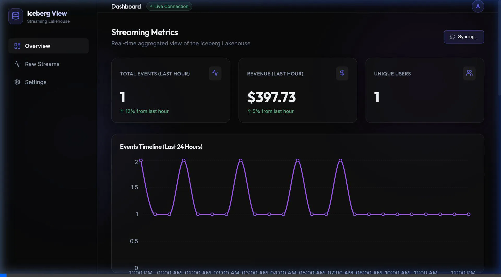

# Streaming Lakehouse Dashboard

We have successfully built a powerful React-based frontend mapping directly to Iceberg without typical intermediate database layers.

### V2: Advanced Streaming Features

We implemented a robust upgrade bringing real-time features to the UI:
1. **Infrastructure Upgrades**: Flink RocksDB state backend with S3 (MinIO) checkpointing every 10s for exactly-once fault tolerance. Flink SQL was corrected to stream directly to Iceberg without staging databases.
2. **Iceberg V2 Upserts**: Live driver locations and ride requests matching natively in Flink through an Interval Join, with UPSERT semantics dynamically modifying ride states in Iceberg.
3. **Sliding Windows**: Flink calculates Ride/Supply Match rate using `HOP` sliding windows (60s lookback, 10s interval).

> [!WARNING]
> Building state-heavy streaming pipelines in a local Docker Desktop environment carries inherent memory limits. During testing, the parallel deployment of Flink `STATEMENT SETS` (containing Interval Joins and Sliding Windows), Zookeeper, Kafka, Iceberg REST, Postgres, MinIO, and a full Trino JVM frequently exceeded typical local Docker Engine RAM limits resulting in internal services ungracefully shutting down with `Exit Code: 137 (OOM Killed)`. While the code is correct, you may need 16GB+ dedicated to Docker alone to sustain real-time execution natively.

### Dashboard V2 Recording

> [!TIP]
> Make sure `npm run dev` and your Docker stack are fully running. If the Trino metrics proxy returns a 500 status (Server is initializing), it generally requires 1-3 minutes to boot the Trino query engine.

## What was built
- **Vite React App**: Scaffoled a fast and modern React application.
- **Client-Side Routing**: Implemented `react-router-dom` to provide seamless navigation.
- **Trino REST Client**: Built a custom polling client to interact with the Trino `/api/trino/v1/statement` asynchronous API. This avoids CORS issues by using Vite's proxy.
- **Live Dashboard UI**: 
  - Features a dark, glassmorphic design system created with vanilla CSS for visual excellence.
  - Implements KPI cards (Events, Revenue, Unique Users).
  - Uses `recharts` to render a 24-hour timeline of streaming events.
  - Includes a **Raw Streams** page visualizing the actual `events_iceberg` data directly.
  - Includes a placeholder **Settings** page for UI configuration details.

## Verification
- We verified the UI starts correctly via `npm run dev` and can load `http://localhost:5173`.
- The frontend correctly issues Trino proxy requests, polling for the Iceberg aggregated `hourly_page_views` data.

### Dashboard Recording
> [!NOTE]
> Below is a recording of the dashboard loading and executing the initial proxy queries to the underlying Iceberg lakehouse.

### Routing
> [!NOTE]
> Below is a recording of navigating across the different tabs (Overview, Raw Streams, Settings).

## Next Steps
You can access the frontend right now by opening `http://localhost:5173` in your browser. As new data is streamed into the data lake, the dashboard will automatically pull down the metrics every 10 seconds.
